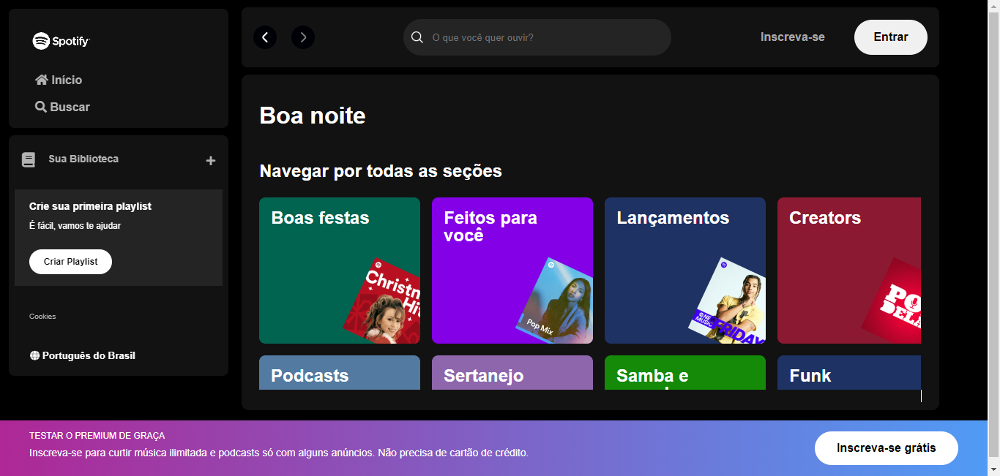

# PROJETO BASEADO NA LANDING PAGE DO SPOTIFY

## 📝Finalidade
- Projeto com inspiração na página principal do spotify

## 👨‍💻Funcionalidade
- [x] Projeto feito com HTML, CSS e JavaScript.

- [x] Ao rodar em servidor local a aba de busca irá dar resultados de alguns artistas.

## Print

### 🖥️Imagem do Site



## 💻Como rodar este projeto?

1. No GitHub.com, navegue até a página principal do repositório.<br><br>
2. Acima da lista de arquivos, clique em <svg xmlns="http://www.w3.org/2000/svg" width="16" height="16" viewBox="0 0 24 24"><path fill="currentColor" d="M15.22 4.97a.75.75 0 0 1 1.06 0l6.5 6.5a.75.75 0 0 1 0 1.06l-6.5 6.5a.749.749 0 0 1-1.275-.326a.749.749 0 0 1 .215-.734L21.19 12l-5.97-5.97a.75.75 0 0 1 0-1.06Zm-6.44 0a.75.75 0 0 1 0 1.06L2.81 12l5.97 5.97a.749.749 0 0 1-.326 1.275a.749.749 0 0 1-.734-.215l-6.5-6.5a.75.75 0 0 1 0-1.06l6.5-6.5a.75.75 0 0 1 1.06 0Z"/></svg> Código.
!<br><br>

3. Copie a URL do repositório.

   - Para clonar o repositório usando HTTPS, em "HTTPS", clique em <svg xmlns="http://www.w3.org/2000/svg" width="16" height="16" viewBox="0 0 16 16"><path fill="currentColor" d="M3.626 3.533a.249.249 0 0 0-.126.217v9.5c0 .138.112.25.25.25h8.5a.25.25 0 0 0 .25-.25v-9.5a.249.249 0 0 0-.126-.217a.75.75 0 0 1 .752-1.298c.541.313.874.89.874 1.515v9.5A1.75 1.75 0 0 1 12.25 15h-8.5A1.75 1.75 0 0 1 2 13.25v-9.5c0-.625.333-1.202.874-1.515a.75.75 0 0 1 .752 1.298ZM5.75 1h4.5a.75.75 0 0 1 .75.75v3a.75.75 0 0 1-.75.75h-4.5A.75.75 0 0 1 5 4.75v-3A.75.75 0 0 1 5.75 1Zm.75 3h3V2.5h-3Z"/></svg>.

   - Para clonar o repositório usando uma chave SSH, incluindo um certificado emitido pela autoridade de certificação SSH da sua organização, clique em SSH e em <svg xmlns="http://www.w3.org/2000/svg" width="16" height="16" viewBox="0 0 16 16"><path fill="currentColor" d="M3.626 3.533a.249.249 0 0 0-.126.217v9.5c0 .138.112.25.25.25h8.5a.25.25 0 0 0 .25-.25v-9.5a.249.249 0 0 0-.126-.217a.75.75 0 0 1 .752-1.298c.541.313.874.89.874 1.515v9.5A1.75 1.75 0 0 1 12.25 15h-8.5A1.75 1.75 0 0 1 2 13.25v-9.5c0-.625.333-1.202.874-1.515a.75.75 0 0 1 .752 1.298ZM5.75 1h4.5a.75.75 0 0 1 .75.75v3a.75.75 0 0 1-.75.75h-4.5A.75.75 0 0 1 5 4.75v-3A.75.75 0 0 1 5.75 1Zm.75 3h3V2.5h-3Z"/></svg>.

   - Para clonar um repositório usando a GitHub CLI, clique em GitHub CLI e em <svg xmlns="http://www.w3.org/2000/svg" width="16" height="16" viewBox="0 0 16 16"><path fill="currentColor" d="M0 6.75C0 5.784.784 5 1.75 5h1.5a.75.75 0 0 1 0 1.5h-1.5a.25.25 0 0 0-.25.25v7.5c0 .138.112.25.25.25h7.5a.25.25 0 0 0 .25-.25v-1.5a.75.75 0 0 1 1.5 0v1.5A1.75 1.75 0 0 1 9.25 16h-7.5A1.75 1.75 0 0 1 0 14.25Z"/><path fill="currentColor" d="M5 1.75C5 .784 5.784 0 6.75 0h7.5C15.216 0 16 .784 16 1.75v7.5A1.75 1.75 0 0 1 14.25 11h-7.5A1.75 1.75 0 0 1 5 9.25Zm1.75-.25a.25.25 0 0 0-.25.25v7.5c0 .138.112.25.25.25h7.5a.25.25 0 0 0 .25-.25v-7.5a.25.25 0 0 0-.25-.25Z"/></svg>.
   <br><br>

4. Abra Git Bash.<br><br>

5. Altere o diretório de trabalho atual para o local em que deseja ter o diretório clonado.<br><br>

6. Digite *git clone* e cole a URL já copiada<br>
  - Exemplo: 
    ```bash
    git clone https://github.com/YOUR-USERNAME/YOUR-REPOSITORY
    ```
    <br><br>
    
7. Pressione *ENTER* para criar seu clone local.
  - Exemplo: 
```bash 
    $ git clone https://github.com/YOUR-USERNAME/YOUR-REPOSITORY
    Cloning into `Spoon-Knife`...
    remote: Counting objects: 10, done.
    remote: Compressing objects: 100% (8/8), done.
    remove: Total 10 (delta 1), reused 10 (delta 1)
    Unpacking objects: 100% (10/10), done.
```
<br>

* Caso ocorra algum erro na clonagem do repositório, é só acessar o site:<br>

  * [Solucionar problemas de erros de clonagem](https://docs.github.com/pt/repositories/creating-and-managing-repositories/cloning-a-repository#troubleshooting-cloning-error)

<br>

## 🔧Tecnologias Utilizadas
1. [HTML - Linguagem de Marcação de Hipertexto](https://pt.wikipedia.org/wiki/HTML)<hr/>
2. [CSS - Cascading Style Sheets](https://pt.wikipedia.org/wiki/Cascading_Style_Sheets)<hr/>
3. [JS - JavaScript](https://www.javascript.com)<hr/>
4. [VSC - Visual Studio Code](https://code.visualstudio.com)<hr/>
5. [React](https://react.dev/)<hr/>
6. [Font Awesome](https://fontawesome.com/)<br><hr/>

# 🔗Link para acessar o deploy no GitHub

[]()